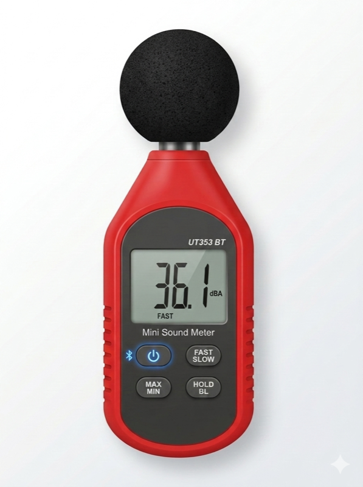

# Uni-T UT353BT — Home Assistant Integration

A [HACS](https://hacs.xyz) custom integration that brings the
[Uni-T UT353BT Mini Sound Level Meter](https://meters.uni-trend.com/product/ut353-ut353bt/)
into Home Assistant. It uses HA's native Bluetooth APIs, so both the
built-in adapter **and** [ESPHome Bluetooth proxies](https://esphome.io/components/bluetooth_proxy.html)
work out of the box.

 

---

## Entities

| Entity | Type | Description |
|---|---|---|
| Sound Level | Sensor | Current reading in dBA, updated on each poll |
| Battery Low | Binary Sensor | `On` when the battery is low |
| Mode | Select | **Normal** / **Max** (peak hold) / **Min** (valley hold) |
| Response Speed | Select | **Fast** (~125 ms) or **Slow** (~1 s) |
| Hold | Switch | Freeze the current reading on the meter display |
| Connection Status | Sensor *(diagnostic)* | `Connected` / `Connecting` / `Disconnected` |
| Signal Strength | Sensor *(diagnostic)* | RSSI in dBm |
| Last Seen | Sensor *(diagnostic)* | Timestamp of the most recent successful reading |

---

## Requirements

- Home Assistant 2024.1 or later
- A Bluetooth adapter accessible to HA (built-in, USB dongle, or [ESPHome Bluetooth proxy](https://esphome.io/components/bluetooth_proxy/))
- Uni-T UT353BT meter, powered on with Bluetooth enabled

---

## Installation

### Via HACS (recommended)

1. Open HACS → **Integrations** → ⋮ → **Custom repositories**.
2. Add this repository URL and select category **Integration**.
3. Search for **Uni-T UT353BT** and click **Download**.
4. Restart Home Assistant.

### Manual

Copy the `custom_components/ut353bt/` folder into your HA
`config/custom_components/` directory and restart Home Assistant.

---

## Configuration

1. Power on the meter and enable Bluetooth.
2. Go to **Settings → Devices & Services** in Home Assistant.
3. A discovered **UT353BT** notification will appear — click **Configure**.
   - If auto-discovery does not appear, click **+ Add Integration**, search for *UT353BT*,
     and enter the Bluetooth MAC address manually.
4. To adjust the polling interval, click **Configure** ⚙️ on the integration card and set a
   value between 1 and 300 seconds (default: 5 s). A shorter interval gives more
   responsive readings but keeps the BLE connection busier.

---

## Diagnostics

To help troubleshoot issues, open the device page and click **Download diagnostics**.
The downloaded JSON contains connection state, last reading, signal strength, and other
debug info — the MAC address is redacted automatically.

---

For contributor and developer information see [DEVELOPMENT.md](DEVELOPMENT.md).

## **⚠️ Disclaimer**
> This is a personal hobby project. I am not affiliated with, endorsed by, or
> in any way connected to Uni-T (Uni Trend Technology). The BLE protocol was
> reverse-engineered from packet captures and may break with firmware updates.
> **Use at your own risk — no warranty of any kind is provided.**
