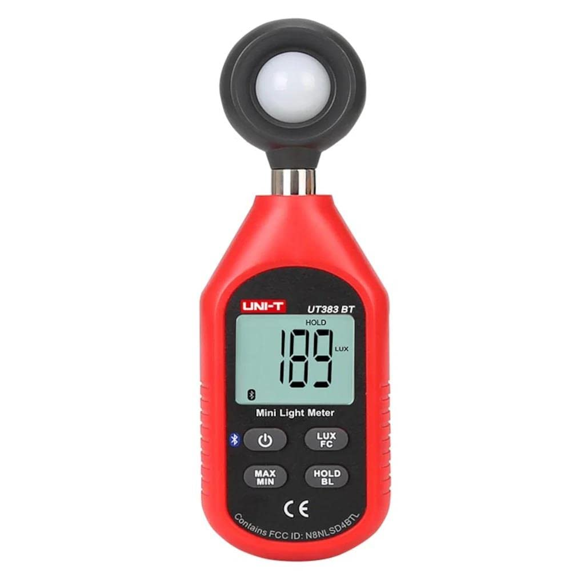

# Uni-T UT383BT Lux Meter — Home Assistant Integration

A [HACS](https://hacs.xyz) custom integration that brings the
**Uni-T UT383BT Bluetooth Lux Meter** into Home Assistant as an illuminance
sensor. It uses HA's native Bluetooth APIs, so both the built-in adapter
**and** [ESPHome Bluetooth proxies](https://esphome.io/components/bluetooth_proxy.html)
work out of the box.

 

---

## Entities

| Entity | Type | Description |
|---|---|---|
| Illuminance | Sensor | Current reading in lux, updated on each poll |
| Connection Status | Sensor *(diagnostic)* | `Connected` / `Connecting` / `Disconnected` |
| Signal Strength | Sensor *(diagnostic)* | RSSI in dBm |
| Last Seen | Sensor *(diagnostic)* | Timestamp of the most recent successful reading |

This is a **read-only** integration: it polls the meter and reports the
illuminance. The meter's on-device buttons (hold, lux/fc unit toggle, backlight)
are not exposed — see [Limitations](#limitations).

---

## Requirements

- Home Assistant 2024.1 or later
- A Bluetooth adapter accessible to HA (built-in, USB dongle, or [ESPHome Bluetooth proxy](https://esphome.io/components/bluetooth_proxy/))
- Uni-T UT383BT meter, powered on with Bluetooth enabled

---

## Installation

### Via HACS (recommended)

1. Open HACS → **Integrations** → ⋮ → **Custom repositories**.
2. Add `https://github.com/edmondharty/ha-ut383bt-lux-meter` and select category **Integration**.
3. Search for **Uni-T UT383BT Lux Meter** and click **Download**.
4. Restart Home Assistant.

### Manual

Copy the `custom_components/ut383bt/` folder into your HA
`config/custom_components/` directory and restart Home Assistant.

---

## Configuration

1. Power on the meter and enable Bluetooth.
2. Go to **Settings → Devices & Services** in Home Assistant.
3. A discovered **UT383BT** notification will appear — click **Configure**.
   - If auto-discovery does not appear, click **+ Add Integration**, search for *UT383BT*,
     and enter the Bluetooth MAC address manually.
4. To adjust the polling interval, click **Configure** ⚙️ on the integration card and set a
   value between 1 and 300 seconds (default: 5 s). A shorter interval gives more
   responsive readings but keeps the BLE connection busier.

> **Note:** the meter accepts only one Bluetooth connection at a time. Close the
> official Uni-T app before adding the meter to Home Assistant.

---

## How it works

The meter exposes a vendor GATT service (`0xff12`) with a write characteristic
(`0xff01`) and a notify characteristic (`0xff02`). On each poll the integration
writes a single `0x5E` byte to `0xff01`; the meter replies with a 19-byte
notification on `0xff02` containing the reading as ASCII text, e.g.
`"  158LUX"`. The protocol was reverse-engineered from a Bluetooth HCI capture.

---

## Limitations

- **Read-only.** Hold, the lux/foot-candle unit toggle, and the backlight are not
  controllable — those commands have not been captured yet.
- **Status word not decoded.** Each reading carries a 4-byte status word whose
  bits (likely hold / low-battery / range) are not yet interpreted; the raw value
  is preserved in diagnostics for future decoding.
- **High-range multiplier unverified.** All captured readings were whole-number
  lux in the mid range. If the meter uses a decade multiplier at the very top of
  its range, that is not yet handled.

Contributions of captures covering these states are welcome.

---

## Diagnostics

To help troubleshoot issues, open the device page and click **Download diagnostics**.
The downloaded JSON contains connection state, last reading, signal strength, and other
debug info — the MAC address is redacted automatically.

---

For contributor and developer information see [DEVELOPMENT.md](DEVELOPMENT.md).

---

## Credits

This integration is derived from the
[ha-uni-t-ble](https://github.com/daweizhangau/ha-uni-t-ble) project by
**Dawei Zhang** (MIT License), which targets the UT353BT sound level meter. The
UT383BT lux meter shares the same BLE framing, so the BLE client and coordinator
are adapted from that work. Thanks to the original author.

---

## **⚠️ Disclaimer**
> This is a personal hobby project. It is not affiliated with, endorsed by, or
> in any way connected to Uni-T (Uni Trend Technology). The BLE protocol was
> reverse-engineered from packet captures and may break with firmware updates.
> **Use at your own risk — no warranty of any kind is provided.**

## License

[MIT](LICENSE) © 2026 Dawei Zhang (original work) and contributors.
